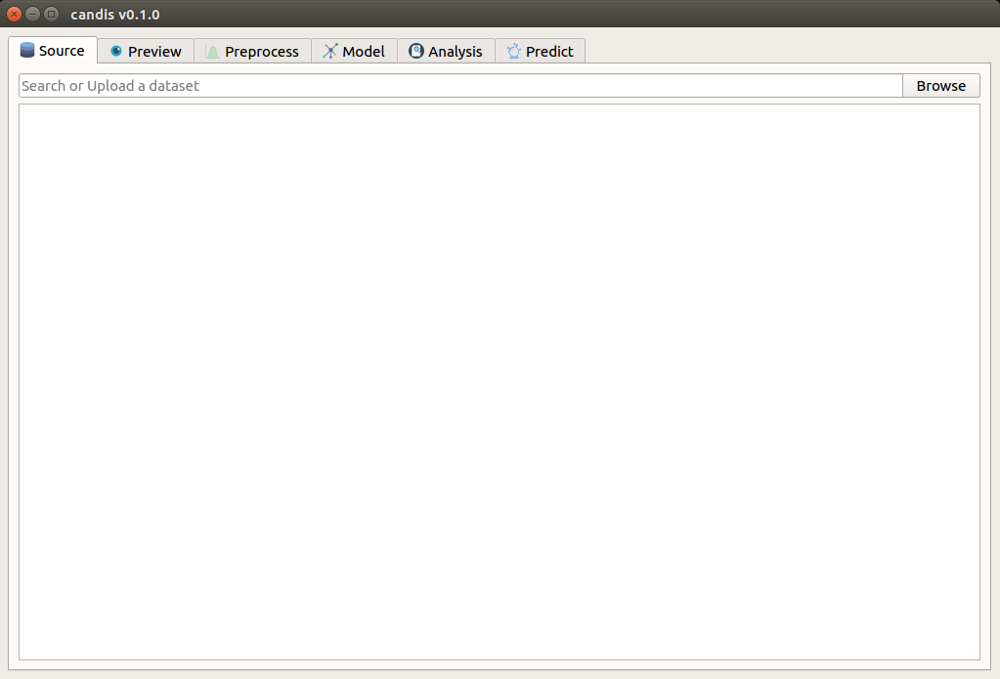

# candis
> A machine learning Cancer Discovery application.



This project is a Graphical User Interface extension to the command-line tool [CancerDiscover](https://github.com/HelikarLab/CancerDiscover) developed by [Helikar Lab](http://helikarlab.org).

### Table of Contents
* Installation
* Usage
* License

### Installation
Clone the repository onto your desktop.
```console
$ git clone https://github.com/achillesrasquinha/candis.git && cd candis
```

Install necessary dependencies
```console
$ pip install -r requirements.txt
```

### Usage
```console
$ make run
```

### TODO
- [ ] Data Selection (40%)
	- [x] Selecting a .CEL file from a local machine.
	- [ ] Selecting remotely from the National Centre for Biotechnology Information (NCBI) database.
- [ ] Data Visualization (*low priority*)
- [ ] Data Preprocessing (3%)
	- [ ] Data Normalization
		- [ ] Quantile Normalization
		- [ ] RMA Background Correction
		- [ ] Additional (*low priority*)
- [ ] Modelling (3%)
	- [ ] Train/Test Split
	- [ ] Cross-Validation
	- [ ] Selecting classifiers
- [ ] Evaluation (3%)
- [ ] Analysis (3%)
	- [ ] Feature Selection
- [ ] Prediction (3%)
	- [ ] Unknown data input
	- [ ] Loading a custom model
- [ ] Unit Testing (3%)
- [ ] Documentation
- [ ] Miscellaneous
	- [ ] Custom GUI Styling
	- [ ] Menu information
	- [ ] Suggessions? Send in a pull-request!

### License
This repository has been released under the [GNU GPL License](LICENSE).